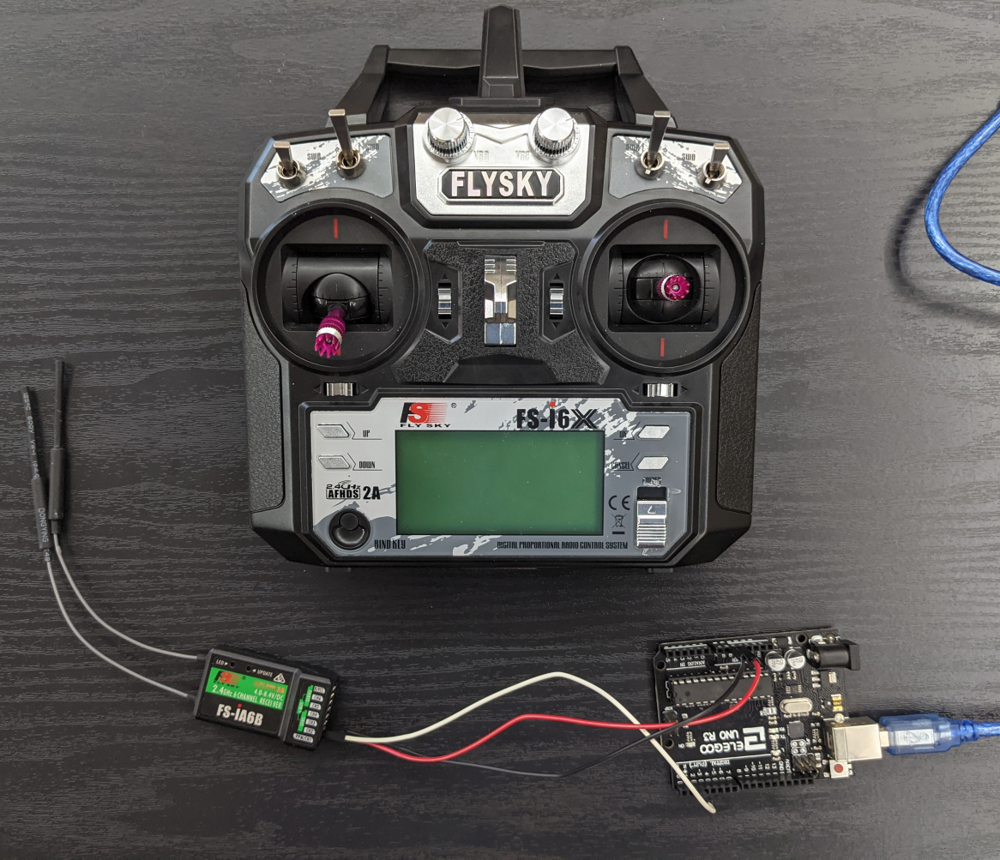
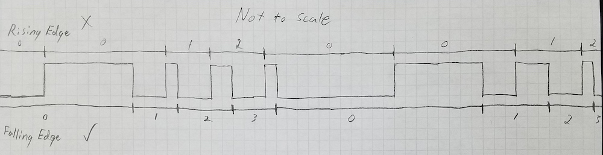

# Reading values from a PPM based RX receiver

I had quite a bit of trouble figuring out exactly how to read PPM signals from
my radio receiver (the fs-ia6b), so I figured I'd share my solution to help
anyone else who runs into similar trouble.

## Code Examples

Examples for the following MCUs have been implemented so far:

* [Arduino](arduino_example.ino)
* [Microbit](microbit_example.py) - Has some issues with interrupt timing, START_FRAME_LENGTH may need to be tuned
* [Photon](photon_example.ino) - This example includes the RGBW example code mentioned below.

## Hardware Used

* Radio Transmitter
  * Flysky FS-i6X - [Amazon Link](https://www.amazon.com/gp/product/B0744DPPL8/)
* Arduino
  * Elegoo UNO - [Amazon Link](https://www.amazon.com/gp/product/B01EWOE0UU/)

## What is PPM?

PPM is a method of communicating using pulses of high/low signal, similar to
PWM. For this particular receiver, each "frame" of data is represented by a
starting pulse of 2ms/2000μs (milliseconds/microseconds), followed by a pulse
between 700-1700μs for each data channel. Each pulse/signal is separated by a
300μs low signal, creating a minimum pulse of 1000μs and maximum of 2000μs for
each channel. There is a padding delay between each frame of data, such that
each frame lasts around 22.5ms in total.

One important thing to note is that a falling edge is preferred over a rising
edge for setting up your pin interrupt, as it better handles the delay between
PPM frames. See the following diagram:

With everything properly setup, you can get all the available channels stored
within an array, to be used by whatever applications you may have for it. Some
examples that I've done is using 3 of the joystick channels for controlling RGB
on a RGBW neopixel array, and one of the flip switches to turn the W LEDs
on/off. Another use-case is translating the third channel (the throttle joystick
Y axis) to control an ESC 1:1.

With the provided example code, you should be able to plug the receiver into pin
2, and view the serial plotter:

